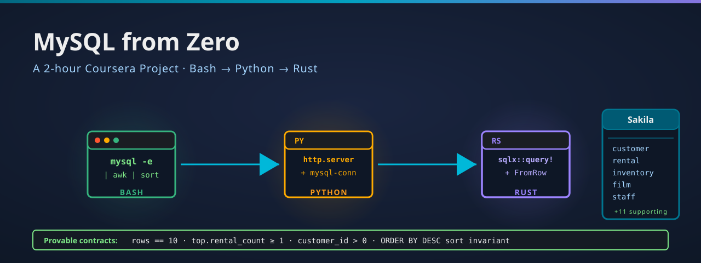

<p align="center">
  
</p>

[](https://github.com/paiml/mysql-from-zero/actions/workflows/ci.yml)
[](#license)
[](rust-toolchain.toml)
[](Makefile)
[](contracts/)

# mysql-from-zero

Companion repo for **MySQL from Zero**, a course in the Coursera **Rust for Data Engineering** specialization (Pragmatic AI Labs · Noah Gift). Three modules, twelve lessons, end-to-end from `mysql -u root -p` to a typed Rust client built on `sqlx::MySqlPool` with four runtime `assert!` contracts.

## What's in this repo

- `compose.yml` — local MySQL 8.4 node with `log-bin-trust-function-creators` on so the Sakila stored functions load cleanly
- `sql/` — schema bootstrap, the customer→rental→inventory→film traversal, and the indexes the EXPLAIN-reading lesson references
- `crates/mysql-rust/` — Rust workspace member with the `top_customers_sqlx` example the closing lesson walks through
- `contracts/mysql-rust-v1.yaml` — provable contracts the runtime asserts enforce, lintable with `pv lint contracts/`

## Quick start

```bash
git clone https://github.com/paiml/mysql-from-zero
cd mysql-from-zero
make up        # docker compose up -d (MySQL 8.4 + empty `sakila` schema)
make sakila    # download + load Sakila schema and data into the container
make test      # cargo test --workspace
```

Run `make help` to see every target. `make sakila` is idempotent — once `sakila-db/sakila-data.sql` exists locally, re-running just re-loads the schema (useful if you `DROP DATABASE` and want a fresh seed). To nuke the database entirely (volume + container), run `make nuke` then `make up && make sakila`.

## Closing demo: `top_customers_sqlx`

The `top_customers_sqlx` example closes the loop the course opens. Module 1's `bash-pipelines-with-mysql` lesson surfaces the top renters via `mysql -e ...`, the `mysql-to-python-webserver` lesson serves the same answer from a Python `http.server`, Module 2 walks the customer→rental→inventory→film traversal as a JOIN, and this binary returns the identical row set through typed Rust via `sqlx::MySqlPool`:

```bash
make up && make sakila        # MySQL container + Sakila loaded (one-time)
cargo run -p mysql-rust --example top_customers_sqlx
```

Sample output (top of the JSON array):

```json
[
  {
    "customer_id": 148,
    "first_name": "ELEANOR",
    "last_name": "HUNT",
    "rental_count": 46
  },
  ...
]
```

The demo expects the compose.yml-provided Sakila to be running on `127.0.0.1:3306` with `user=app password=appdev db=sakila`. Override with `MYSQL_URL=mysql://...` if your database lives elsewhere. Embedded runtime `assert!` contracts fail loudly if the query returns fewer than 10 rows, the top customer has 0 rentals, any `customer_id` is non-positive, or the result is not sorted by rental count descending.

## Course outline

Twelve lessons across three modules:

- **Module 1 — MySQL Fundamentals** (7 lessons). The mysql terminal client, mysqldump backup-and-restore, importing Sakila, INSERT/UPDATE/DELETE on a real schema, mysql -e shell pipelines, and a Python http.server backed by a live database.
- **Module 2 — Sakila Schema, JOINs, and Indexes** (3 lessons). The 16-table Sakila entity-relationship diagram, INNER vs LEFT JOIN with row-by-row materialization, and B-tree indexes paired with EXPLAIN plan reading.
- **Module 3 — Typed Rust Client with sqlx** (2 lessons). The Rust↔MySQL type mapping cheatsheet (FromRow correspondences and the three traps to avoid), and the closing `top_customers_sqlx` demo that runs the customer-rental query against this Docker Compose Sakila with four runtime `assert!` contracts.

The full course ships as part of the **Rust for Data Engineering** specialization on Coursera, alongside ETL Pipelines with Rust, SQL Databases with Rust (Postgres-flavored), Polars from Zero, Rust Serverless, Vector Databases with Rust, and more.

## Provable contracts

Every demo binary in this repo carries runtime `assert!` contracts that fail loudly when data drifts. The four invariants the closing example enforces are documented in [`contracts/mysql-rust-v1.yaml`](contracts/mysql-rust-v1.yaml):

1. **Row count exact** — `LIMIT 10` must return exactly 10 rows on the canonical Sakila fixture
2. **Top renter has rentals** — `rows[0].rental_count >= 1` (sentinel that the LEFT JOIN actually matched)
3. **Customer IDs positive** — every `r.customer_id > 0` (AUTO_INCREMENT integrity)
4. **Sort invariant** — `rows[i].rental_count >= rows[i+1].rental_count` (ORDER BY DESC was preserved)

Lint with `pv lint contracts/` (from the [aprender-contracts-cli](https://crates.io/crates/aprender-contracts-cli) crate). The CI gate runs this on every push.

## License

Dual-licensed under either of

- [Apache License, Version 2.0](LICENSE-APACHE)
- [MIT License](LICENSE-MIT)

at your option.
